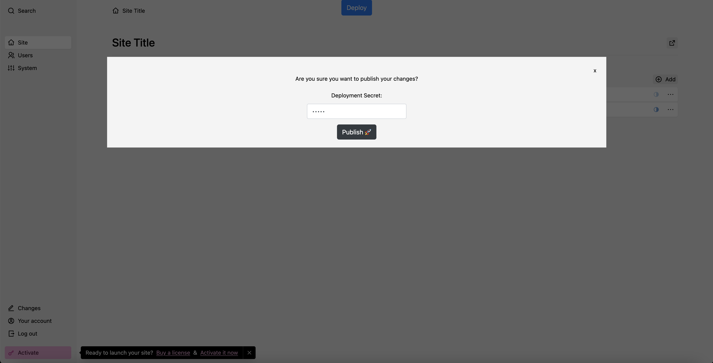
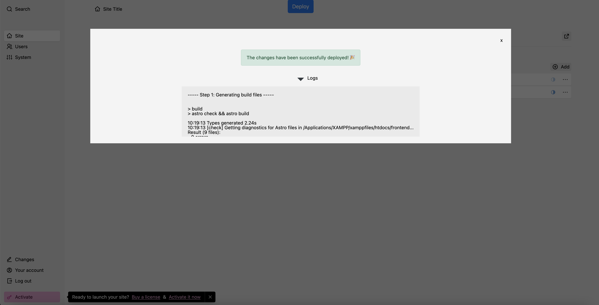

# Kirby Astro Template

A (plain) starter template for utilizing the [flat file CMS Kirby](https://getkirby.com/) headlessly alongside the [SSG Astro](https://astro.build/) on a single server.

## Installation

1. Create a .env file and specify the `DOMAIN` you want to publish as well as a `DEPLOYMENT_KEY` for security reasons:

```txt
DOMAIN="my-website.com"
DEPLOYMENT_KEY="my-secret-password"
```

2. Install the Dependencies for Astro:

    1. `cd frontend/`
    2. `(sudo) npm install`

3. (Optional): Give permission rights to your htdocs folder if using XAMPP or anything similiar:

`sudo chmod -R 777 /path/to/XAMPP/xamppfiles/htdocs`

## Usage

The Kirby Panel is available at [http://localhost/cms/panel/site](http://localhost/cms/panel/site)

Since Kirby is installed in a subdirectory called `cms`, you can access the Kirby data with the prefix `/cms`. For example, the Kirby homepage data is available via [http://localhost/cms](http://localhost/cms). If you would create e.g. an `about` page , it would be available via [http://localhost/cms/about](http://localhost/cms/about) and so forth. 

The static files from Astro will be placed in the root directory. You can define your Astro pages as usual - if you need data from the CMS you just have to create a corresponding page and add this page to the `page.ts` definition:

```ts
// frontend/src/types/pages.ts
export enum Page {
    HOME = "/",
    ABOUT = "/about",
}
```

And to fetch the CMS data in Astro use the `EnvironmentHelper`: 

```ts
// Example: Retrieving the HomePage
const response = await fetch(
    `${EnvironmentHelper.getFetchBaseURL()}${Page.HOME}`
);

// Example: Retrieving the AboutPage
const response = await fetch(
    `${EnvironmentHelper.getFetchBaseURL()}${Page.ABOUT}`
);
```

## Deployment

KirbyCMS changes are deployed instantly. To deploy Astro Pages to the Page you can use the Deploy Button in the Kirby Panel which will generate the static assets and move the assets file to the root directory to make them available. 
The deployment secret is the secret which you specified in the `.env` file (`$DEPLOYMENT_KEY`).





## Architecture


